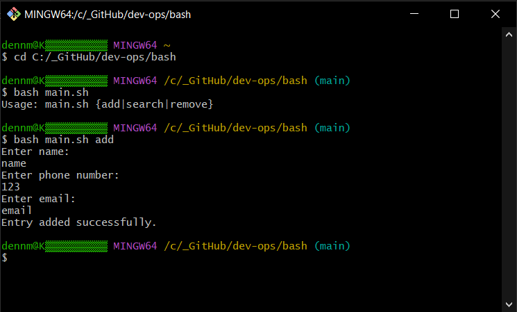
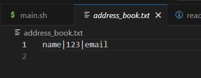
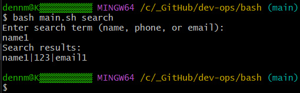
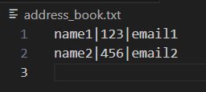
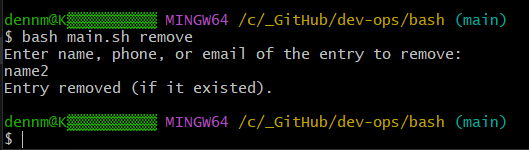
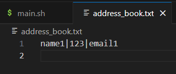

# Address Book Program

This is a simple command-line address book program written in bash. The program allows you to add, search, and remove entries from an address book. All entries are saved in a text file (`address_book.txt`).

## 🚀 Usage

You can use the following commands with the script:

- `bash main.sh add`: Adds a new entry to the address book.
- `bash main.sh search`: Searches for an entry in the address book.
- `bash main.sh remove`: Removes an entry from the address book.

### 🔧 Example Commands

1. **Add a new entry**:
   ```bash
    bash main.sh add
   ```

2. **Search for an entry**:
   ```bash
    bash main.sh search
   ```

3. **Remove an entry**:
   ```bash
    bash main.sh remove
   ```

---

## ✨ Features

### ➕ Add

When you use the `add` command, the program will prompt you for the following details:
- Name
- Phone number
- Email

The data will be saved in the format: `Name|Phone|Email` in the `address_book.txt` file.

#### Example:
```bash
bash main.sh add
```

- Output:

```
Enter name:
John Doe
Enter phone number:
123456789
Enter email:
johndoe@example.com
Entry added successfully.
```

---

### 🔍 Search

The `search` command allows you to search for entries in the address book by providing a search term (name, phone, or email).

#### Example:
```bash
bash main.sh search
```

- Output:

```
Enter search term (name, phone, or email):
John
Search results:
John Doe|123456789|johndoe@example.com
```

---

### ❌ Remove

The `remove` command removes an entry that matches the name, phone, or email provided by the user. The program will find and remove the corresponding entry.

#### Example:
```bash
bash main.sh remove
```

- Output:

```
Enter name, phone, or email of the entry to remove:
John Doe
Entry removed (if it existed).
```

---

## 📸 Screenshots

### ➕ Adding an Entry





### 🔍 Searching for an Entry



### ❌ Removing an Entry (Before)



### ❌ Removing an Entry (After)





---

## 📝 Notes

- The address book entries are stored in a file named `address_book.txt`. Make sure this file exists in the same directory as the script or it will be **created automatically**.
- Special characters in search terms are handled by escaping them to prevent issues in pattern matching.

---

This README was created with the assistance of ChatGPT!
